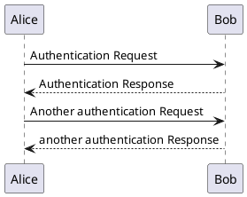

# PlantUML HTTP service [](https://circleci.com/gh/bitjourney/plantuml-service)

This is a high-performance HTTP interface to [PlantUML](http://plantuml.com/).

## Table of Contents

<!-- TOC depthFrom:2 -->

- [Table of Contents](#table-of-contents)
- [Install](#install)
    - [Jar](#jar)
    - [Homebrew Tap](#homebrew-tap)
- [Usage](#usage)
    - [`GET /svg/:source`](#get-svgsource)
    - [`GET /version`](#get-version)
- [Development](#development)
- [Deployment](#deployment)
    - [Run on Heroku](#run-on-heroku)
    - [Run with systemd](#run-with-systemd)
- [Release Engineering](#release-engineering)
- [See Also](#see-also)
- [Authors](#authors)
- [License](#license)

<!-- /TOC -->

## Install

There's two way to install plantuml-service:

### Jar

Get `plantuml-service.jar` from [GitHub releases](https://github.com/bitjourney/plantuml-service/releases).

### Homebrew Tap

There is a homebrew formula in [bitjourney/homebrew-self](https://github.com/bitjourney/homebrew-self) for macOS:

```sh
brew install bitjourney/self/plantuml-service
brew services start bitjourney/self/plantuml-service
```

## Usage

### `GET /svg/:source`

Returns an SVG image of `:source` processed by PlantUML.

`:source` is source code of PlantUML, encoded in [percent encoding](https://en.wikipedia.org/wiki/Percent-encoding).

Example:

Given a PlantUML source code:



To show it in SVG:

```markdown

```

Then, you'll get:

<a href="https://plantuml-service.herokuapp.com/svg/%40startuml%0AAlice%20-%3E%20Bob%3A%20Authentication%20Request%0ABob%20--%3E%20Alice%3A%20Authentication%20Response%0A%0AAlice%20-%3E%20Bob%3A%20Another%20authentication%20Request%0AAlice%20%3C--%20Bob%3A%20another%20authentication%20Response%0A%40enduml%0A"></a>

This path takes multiple `config` parameters to set configuration, for example:

`/svg/...?config=scale max 1024 width&config=skin BlueModern`

NOTE: you should use server-side RPC to render SVG because browsers have URL limitations.

### `GET /version`

Shows the version of PlantUML and plantuml-service in JSON:

```json
{"PlantUML":"2017.11","plantuml-service":"1.0.9"}
```

This is also intended to check the service helth.

Example:

* https://plantuml-service.herokuapp.com/version

## Development

Run on local:

```sh
./gradlew stage && heroku local:start
```

## Deployment

### Run on Heroku


Deploy to Heroku:

```sh
# build
./gradlew stage

# run
bin/plantuml-service $PORT
```

### Run with systemd

Here is an example systemd.service(5) config file:

```ini
[Unit]
Descrption=PlantUML service
Documentation=https://github.com/bitjourney/plantuml-service
Wants=network-online.target
After=network-online.target

[Service]
ExecStart=$APP_PATH/app/bin/plantuml-service
WorkingDirectory=$APP_PATH/app

User=$APP_USER
Group=$APP_USER

[Install]
WantedBy=multi-user.target
```

## Release Engineering

0. Create the credential file by `echo "oauth=$GITHUB_ACCESS_TOKEN" > ~/.github`
1. Update the version of `build.gradle`
2. Run `./gradlew release`
3. Update the homebrew fomula (see [bitjourney/homebrew-self](https://github.com/bitjourney/homebrew-self))

## See Also

* http://plantuml.com/
* https://github.com/plantuml/plantuml
* https://github.com/plantuml/plantuml-server

## Authors

* FUJI Goro ([gfx](https://github.com/gfx))

## License

Copyright (c) 2016 Bit Journey, Inc.

Licensed under the Apache License, Version 2.0 (the "License");
you may not use this file except in compliance with the License.
You may obtain a copy of the License at

http://www.apache.org/licenses/LICENSE-2.0

Unless required by applicable law or agreed to in writing, software
distributed under the License is distributed on an "AS IS" BASIS,
WITHOUT WARRANTIES OR CONDITIONS OF ANY KIND, either express or implied.
See the License for the specific language governing permissions and
limitations under the License.
